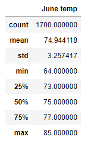
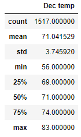

# surfs_up
Analysis for wheather data with Python and SQL

## Overview 
To invest in a surf and ice cream shop we should first investigate the weather data. The main concern is the amount of rain in that location and temperature. To analyze the weather data, SQLAlchemy and python was used to query from the SQLite database.

## Results
The results to compare the temperature in both June and December are shown below:

 

  - The lowest temperature in Dec is 56F which is not suitable for ice cream but it does not mean that Dec is not suitable for ice-cream.
  - The mean temperature in Dec shows that ice-cream can be served all year round. 71F is pretty good temperature for ice-cream.
  - With 3 to 4 degree Farenhait standard deviation in these two months, we can say that there is not much deviation in temperature.
  - Maximum temperature of 83F for December shows that we can sell ice cream all year round.

## Summary
The temperature data were analyzed and it was shown that temperature wise, investing in an icecream shop is a good oppertunity. Another factor that we have to consider is the amount of rain in the island. We can do a quary to get precipitation for different months and compare them. It is suggested to to get the data at least for June and December. Other than this, it is important to note that August and Christmas season is the time we expect the most visitors to the icland. It is important to check the wheather for those two months as well. 

